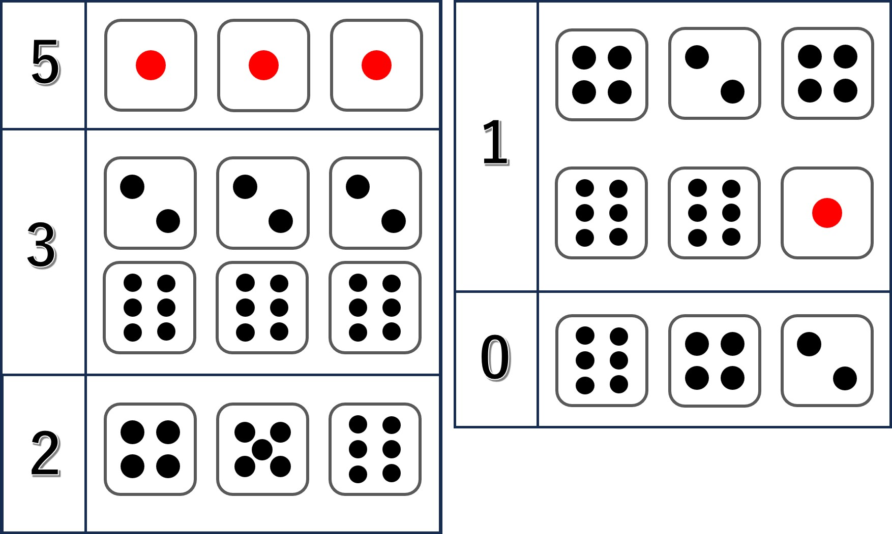
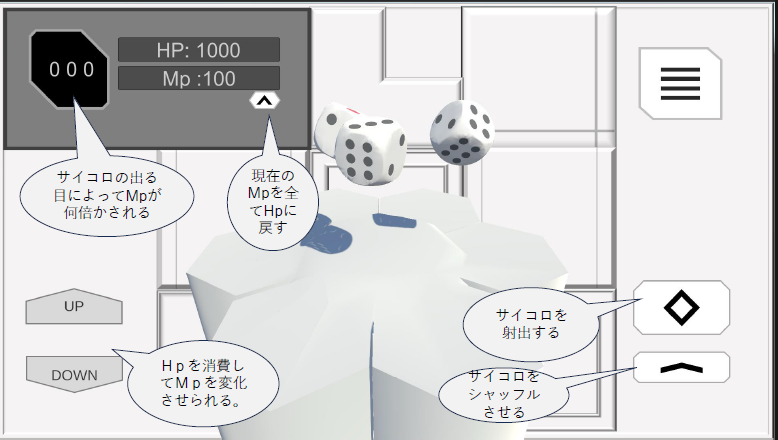

# LevelDice

 

## Table of Contents
1. [Overview](##Overview)
2. [Game Rules](##Game-Rules)
	2-1. [How to protect yourself](###How-to-protect-yourself) 
	2-2. [MP Increase/Decrease](###MP-Increase/Decrease)
	2-3 [Victory condition](###Victory-condition)
3. [How to Play](##How-to-Play)
4. [Mode of Distribution](##Mode-of-Distribution)
5. [Copyrights](##Copyrights)
6. [Disclaimer](##Disclaimer)
7. [Terms of Use](##Terms-of-Use)
8. [Contact Us](##Contact-Us)
9. [Update History](##Update-History)
10. [Credit](##Credit) 

## Overview
- Game title : LevelDice
- Version : 1.0.0
- Category : Casual game
- Feature : Need luck to complete the game
- Difficulty : 2/5
- Play time : 10 minutes
- Number of endings : 2
- Recommended age : All ages
- Production Software : Unity
- Supported OS : Windows, macOS
- Display language : English
- Developer : Impulse Tech (Hereinafter referred to as the "Developer")
- Distributed and Operating : Epsilon Labs, LLC. (Hereinafter referred to as the "Distribution/Operator")

## Game Rules
1. Players have **HP**, which they use to protect themselves from attacks by increasing their **MP**.
2. The damage of attacks increases with each level. The game starts at level 1 and is completed when level 8 is reached. 
3. The game is over if the player's **HP** drops to 0 before level 8 is completed. 

### How to protect yourself
Players can increase their **MP** by consuming **HP**. 
Manage your **MP** well and defend yourself from attacks as you progress.

### MP Increase/Decrease
**MP** increases or decreases depending on the combination of the three dice rolls. 
Depending on the combination of the dice rolls, **MP** can range from 0 to 5 times. 
The figure below shows the multiplier for each combination.
 

### Victory condition
Level 8 to complete the game. 
Keep tracking of your **HP** and **MP** as you progress through the game so that you can complete all levels before your **HP** reaches 0.
 
## How to Play
 

## Mode of Distribution
Freeware

## Copyrights
© 2024 Epsilon Labs, LLC., Impulse Tech
 
## Disclaimer
The **Developer** and **Distribution/Operator** will not be held responsible for any problems or trouble that may occur in the use of this software.
Please use at your own risk.

## Terms of Use
Enacted on 11/10/2024

1. Use of this software in violation of public order and morals is prohibited. 
2. Unauthorized use of this software for commercial purposes is prohibited.
3. As a general rule, live streaming and derivative works of this software are permitted without prior notice.
However, please be sure to clearly state the following in the video description or secondary creation.

	**LevelDice Creator**
	- Developer : Impulse Tech
	- Distribution/Operator : Epsilon Labs, LLC.
	
4. These terms and conditions are subject to change without notice.

If you have any further questions, please use the Contact Us form below.

## Contact Us
- Email Address
[contact@epsilon-labs.co.jp](mailto:contact@epsilon-labs.co.jp)
- Contact Site
[https://epsilon-labs.co.jp/contact](https://epsilon-labs.co.jp/contact)

## Update History
11/10/2024 [Game first published] (ver. 1.0.0)

## Credit
- Impulse Tech (Developer)
- Epsilon Labs, LLC. (Distribution/Operator)
