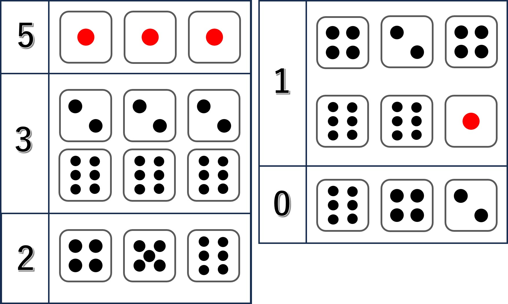
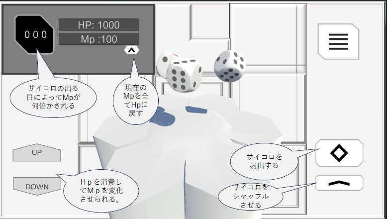

# LevelDice

## 概要
- ゲームタイトル：LevelDice
- バージョン：1.0.0
- ジャンル：カジュアルゲーム
- 特徴：ゲームをクリアするのに運が必要
- ゲーム難度：2/5
- プレイ時間：10分
- エンディング数：２
- 推奨年齢：全年齢
- 制作ソフト：Unity
- 対応OS：Windows, macOS
- 表示言語：英語
- 開発元：インパルス・テック（以下、「開発元」といいます）
- 配信、運営元：[合同会社イプシロン・ラボ](https://epsilon-labs.co.jp/)（以下、「配信、運営会社」といいます）
- 断り書き
このゲームはフィクションです。
実在の人物、団体、事件等とは一切関係ありません。
また、犯罪や殺生を助長する意図はありません。

## ゲームルール
1. プレイヤーは**HP** を持ち、それを使いながら **MP** を増やすことで攻撃から身を守ります。 
2. 攻撃のダメージはレベルが上がるごとに増加します。レベル1から始まり、レベル8に達するとゲームクリアとなります。 
3. レベル8をクリアする前に**HP**が0になると ゲームオーバー になります。 

### 身を守る方法 
プレイヤーは **HP** を消費することで **MP** を増やすことができます。 
**MP**をうまく管理し、攻撃から身を守りながら進行します。

### MPの増減 
**MP**は 三つのサイコロの目 の組み合わせにより増減します。 
サイコロの目の出た組み合わせによって、**MP**は 0倍から5倍 の範囲で変化します。 
組み合わせの倍率を図に表します。
 

### 勝利条件 
レベル8 をクリアすればゲームクリア。 
 **HP**が0になる前に全てのレベルをクリアできるよう、**HP**と**MP**の管理をしながらゲームを進めていきましょう。
 
## 操作方法
 

## 配布形態
フリーウェア

## 著作権
© 2024 Epsilon Labs, LLC., Impulse Tech
 
## 免責事項
当ソフトの利用にあたって、何らかの不具合やトラブルが生じたとしても、
**開発元**と**配信、運営会社**は一切の責任を負いません。
自己責任でご利用ください。

## 利用規約（制定日：2024/11/10）
1. 当ソフトの公序良俗に反する使用を禁止します。
2. 当ソフトの営利目的による無断使用を禁止します。
3. 当ソフトの実況プレイ及び二次創作は、原則事前連絡不要で許可します。
ただし、動画説明欄または二次創作物に下記事項を必ず明記してください。

	**LevelDiceの制作者**
	- 制作者名：インパルス・テック
	- 配信、運営会社：合同会社イプシロン・ラボ
4. 本規約は予告なく変更する場合があります。

その他不明な点がありましたら、下記のお問い合わせをご利用ください。
## お問い合わせ
- メールアドレス
[contact@epsilon-labs.co.jp](mailto:contact@epsilon-labs.co.jp)
- お問い合わせサイト
[https://epsilon-labs.co.jp/contact](https://epsilon-labs.co.jp/contact)

## 更新履歴
2024/11/10 [ゲームの初公開]（ver.1.0.0）

## クレジット
- インパルス・テック（ゲーム制作）
- 合同会社イプシロン・ラボ（ゲーム配信、運営）

